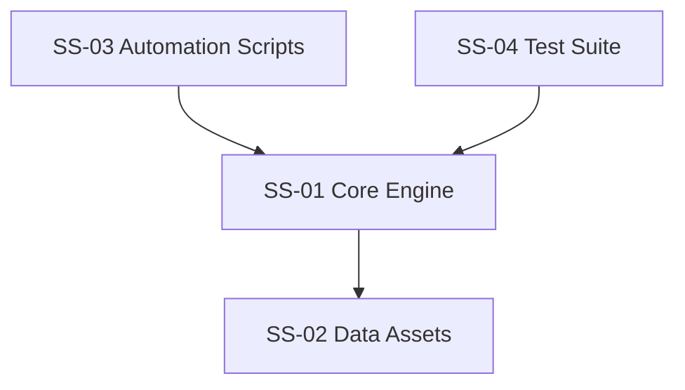

# SUBSYSTEMS

## Registry
| ID | Name | Type | Status | Purpose | Spec |
|---|---|---|---|---|---|
| SS-01 | Core Engine | core | active | Main NL2SQL logic, orchestration, and runtime behavior in `src/`. | `.galdr/subsystems/core-engine.md` |
| SS-02 | Data Assets | support | active | Local datasets, fixtures, and domain data in `data/`. | `.galdr/subsystems/data-assets.md` |
| SS-03 | Automation Scripts | support | active | Helper scripts for setup, maintenance, and tooling in `scripts/`. | `.galdr/subsystems/automation-scripts.md` |
| SS-04 | Test Suite | support | active | Unit/integration/e2e verification in `tests/`. | `.galdr/subsystems/test-suite.md` |

## Dependency Graph

