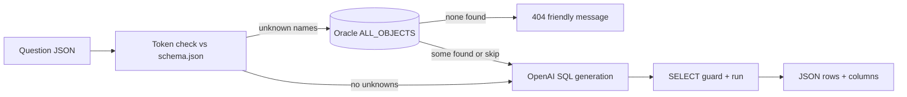
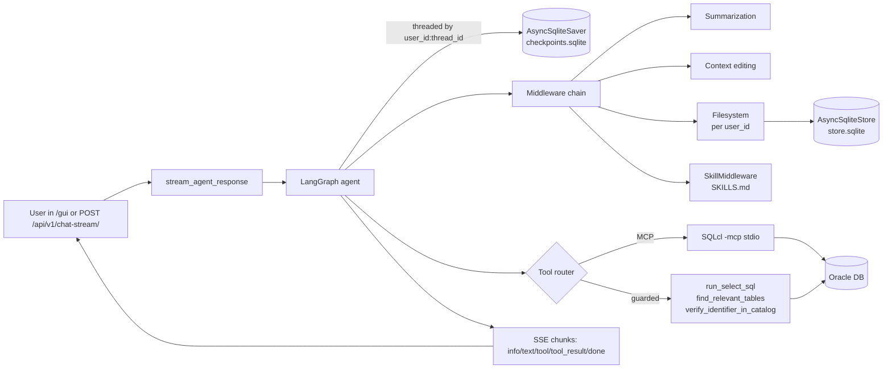

# NL2SQL Agent

A small **FastAPI** service that turns a **natural-language question** into **Oracle SQL**, runs it as a **read-only `SELECT`**, and returns **columns**, **rows**, and timing metadata. Schema context comes from a local **`schema.json`** (exported from your database); the model is **OpenAI**-compatible via `openai`.

---

## What happens when you call `POST /ask`

1. **Startup** loads `.env`, initializes the Oracle client if you use **Thick** mode, parses `data/schema.json` (or `SCHEMA_PATH`), and constructs an `SqlGenerator` bound to your settings.
2. **Rate limit gate** — `/ask` is protected by an in-memory sliding-window limiter per client IP (or `x-forwarded-for` when present). Over-limit requests return **HTTP 429** with a `Retry-After` header.
3. **Off-schema gate (best-effort)** — If the question contains identifier-like tokens that are **not** names in `schema.json` (tables, views, synonyms), the service asks Oracle **`ALL_OBJECTS`** whether those names exist as **TABLE**, **VIEW**, or **MATERIALIZED VIEW** for the **read-only** user. The request is blocked only when Oracle finds **none** of the candidate identifiers. If the catalog query **cannot** run (network, credentials, privileges), the gate **silently skips** so NL2SQL can still proceed.
4. **LLM** — The app builds a schema slice (full catalog or **retrieval-trimmed** tables, depending on env), calls the model, and obtains a single SQL statement.
5. **Cure + Validate (file-backed)** — Before running against Oracle, SQL is parsed in Oracle dialect and checked against names from local `schema.json` (table/view presence + column sanity). Obvious identifier typos are auto-corrected.
6. **Executor + one safe retry** — SQL is validated as **strict read-only `SELECT`** (single statement only; write/DDL/procedural forms rejected) and executed with **row** and **time** limits. If Oracle returns a recoverable class (`syntax`, `missing_table`, `missing_column`, `ambiguous_column`), the app performs **one** repair prompt + **one** retry.



---

## Repository layout

| Path | Role |
|------|------|
| `src/nl2sql_agent/main.py` | FastAPI app, `/health`, `/ask`, `/api/v1/chat*`, lifespan, NiceGUI mount |
| `src/nl2sql_agent/settings.py` | `pydantic-settings` → environment variables |
| `src/nl2sql_agent/schema_loader.py` | Load `schema.json`, budgets, **known object names** |
| `src/nl2sql_agent/schema_retrieval.py` | Fuzzy table selection for trimmed prompts |
| `src/nl2sql_agent/oracle_catalog.py` | **`ALL_OBJECTS`** lookup + friendly 404 copy |
| `src/nl2sql_agent/llm.py` | Direct OpenAI prompt path used by `/ask` |
| `src/nl2sql_agent/executor.py` | sqlglot SELECT-only guard, cure-and-validate, `oracledb` run |
| `src/nl2sql_agent/llm_factory.py` | Multi-provider chat-model factory (OpenAI / Anthropic) |
| `src/nl2sql_agent/mcp_bridge.py` | SQLcl `-mcp` discovery + saved-connection helpers |
| `src/nl2sql_agent/tools.py` | LangChain `@tool` wrappers around the existing safety net |
| `src/nl2sql_agent/skills.py` | `SkillMiddleware` + `load_skill` tool |
| `src/nl2sql_agent/generator.py` | SSE streamer + blocking responder for the agent |
| `src/nl2sql_agent/web.py` | NiceGUI chat page mounted at `/gui` |
| `src/nl2sql_agent/models.py` | `UserMessage` request model for chat endpoints |
| `skills/SKILLS.md` | Skill index injected into the agent's system prompt |
| `memory/` | `AsyncSqliteSaver` + `AsyncSqliteStore` SQLite files (gitignored) |
| `scripts/export_schema.sql` | SQLcl script to emit JSON for `schema.json` |
| `Dockerfile` | Python 3.13-slim + `default-jre-headless` (Java for SQLcl) |
| `tests/` | `pytest` suite |

---

## Prerequisites

- **Python 3.11+**
- **[uv](https://github.com/astral-sh/uv)** for environments and runs
- **OpenAI API key** (`OPENAI_API_KEY`) — or `ANTHROPIC_API_KEY` for the agent path
- **Oracle read-only user** credentials used by **`python-oracledb`** at runtime
- **Java 17+** on `PATH` — only required if you want the chat-agent path (SQLcl needs a JRE)

> Oracle SQLcl is **not** a prerequisite — the install script downloads it into the repo on demand. See step 2 below.

---

## Setup on a new laptop (Windows / macOS / Linux)

This is the same workflow whether you're on a fresh clone of the repo or on a second laptop you're syncing into. PowerShell and bash blocks are interchangeable — pick the one for your shell.

### 1. Clone and install Python deps

**Windows (PowerShell):**
```powershell
git clone <repo-url> nl2sql-agent
cd nl2sql-agent
uv venv
.venv\Scripts\Activate.ps1
uv sync --extra dev
```

**macOS / Linux (bash):**
```bash
git clone <repo-url> nl2sql-agent
cd nl2sql-agent
uv venv
source .venv/bin/activate
uv sync --extra dev
```

You can substitute `uv pip install -r requirements.txt` if you prefer a flat requirements file.

### 2. Install Oracle SQLcl (only for the chat-agent path)

The repo doesn't ship SQLcl binaries (~150 MB) — a one-shot script fetches them into `vendor/sqlcl/` (gitignored). **Skip this step if you only need the legacy `/ask` endpoint.**

**Windows (PowerShell):**
```powershell
pwsh ./scripts/install-sqlcl.ps1
# Or, if PowerShell 7 isn't installed:
powershell -ExecutionPolicy Bypass -File ./scripts/install-sqlcl.ps1
# Reinstall / upgrade:
pwsh ./scripts/install-sqlcl.ps1 -Force
```

**macOS / Linux (bash):**
```bash
chmod +x scripts/install-sqlcl.sh   # one-time after clone
./scripts/install-sqlcl.sh
# Reinstall / upgrade:
./scripts/install-sqlcl.sh --force
```

What it does, in one paragraph: downloads `sqlcl-latest.zip` from `download.oracle.com`, extracts the inner `sqlcl/` folder into `./vendor/sqlcl/`, marks the launcher executable on Unix, cleans the temp files. Idempotent — a second run is a no-op when `vendor/sqlcl/bin/sql(.exe)` already exists. Needs `java -version` to succeed (the script warns and continues if Java is missing).

### 3. Create your `.env`

The repo only contains `.env.example` — the real `.env` is gitignored. **On a new laptop, never re-type credentials by hand: copy your `.env` from a password manager** (1Password / Bitwarden / iCloud Keychain / Keepass). That's the supported way to share credentials between machines — saved-connection passwords inside SQLcl are tied to the local machine fingerprint and won't roam.

**On laptop 1 (first-time fill-in):**

```powershell
Copy-Item .env.example .env       # PowerShell
```
```bash
cp .env.example .env              # bash
```

Then open `.env` in your editor.

**Minimum vars for the `/ask` path:**

| Var | What it is |
|-----|------------|
| `OPENAI_API_KEY`, `OPENAI_MODEL` | LLM credentials (`OPENAI_MODEL` defaults to `gpt-4o`) |
| `ORACLE_DSN` *(or* `ORACLE_HOST` + `ORACLE_SERVICE_NAME`*)* | Database target |
| `ORACLE_RO_USER`, `ORACLE_RO_PASSWORD` | Read-only DB user used by `python-oracledb` |
| `ORACLE_CLIENT_MODE=thick` + `ORACLE_CLIENT_LIB_DIR` | Only if you use Instant Client / full client (typical on Windows) |

**Extra vars for the chat-agent path:**

```env
SQLCL_PATH=vendor/sqlcl/bin/sql.exe       # use vendor/sqlcl/bin/sql on macOS/Linux
SQLCL_USER_DIR=.sqlcl                     # keeps SQLcl's wallet inside the repo (gitignored)
SQLCL_CONNECTIONS=[main,RO_USER/RO_PASSWORD@host:1521/service]
NICEGUI_STORAGE_SECRET=<any random string>
# Optional alternate LLM provider:
# ANTHROPIC_API_KEY=...
# ANTHROPIC_MODEL=claude-sonnet-4-6
```

If you use a **TNS alias** in `ORACLE_DSN`, the alias must resolve via `ORACLE_CLIENT_CONFIG_DIR` / `TNS_ADMIN`, otherwise you'll see **ORA-12154**. Prefer **Easy Connect** (`host:1521/service`) when you have no local `tnsnames.ora`.

### 4. Export `schema.json`

The `/ask` path needs this static catalog snapshot; the agent path can also read schema live via SQLcl-MCP but still benefits from it for retrieval-trimmed prompts. Run once and re-run after any DDL change.

**Windows (PowerShell):**
```powershell
vendor\sqlcl\bin\sql.exe -S -name YOUR_CONN @scripts/export_schema.sql > data\schema.json
```

**macOS / Linux (bash):**
```bash
vendor/sqlcl/bin/sql -S -name YOUR_CONN @scripts/export_schema.sql > data/schema.json
```

`YOUR_CONN` is one of the names from `SQLCL_CONNECTIONS` — the lifespan registers them on boot, but for the schema export you can also save one manually:

```bash
vendor/sqlcl/bin/sql /NOLOG
SQL> conn -save YOUR_CONN -savepwd RO_USER/RO_PASSWORD@host:1521/service
SQL> exit
```

PowerShell sometimes writes redirected output as **UTF-16**; the loader auto-detects both UTF-8 and UTF-16.

### 5. Run

```bash
uv run uvicorn nl2sql_agent.main:app --host 127.0.0.1 --port 8000
```

Then in your browser:

| URL | What it is |
|-----|------------|
| http://127.0.0.1:8000/docs | Swagger UI — try `/ask` and `/api/v1/chat/` interactively |
| http://127.0.0.1:8000/health | Liveness probe |
| http://127.0.0.1:8000/gui/ | NiceGUI chat page (mounted **only when `SQLCL_PATH` is set**) |

`HOST` / `PORT` in `.env` are documentation defaults — the `uvicorn` flags above override them.

### Recap: laptop-2 cloning workflow

```bash
git clone <repo-url> nl2sql-agent && cd nl2sql-agent
uv sync --extra dev
./scripts/install-sqlcl.sh        # or pwsh ./scripts/install-sqlcl.ps1 on Windows
# Paste your .env from your password manager (do NOT commit it)
uv run uvicorn nl2sql_agent.main:app --host 127.0.0.1 --port 8000
```

Three things never live in git: the `.env`, `vendor/sqlcl/` (recreated by the script), and `.sqlcl/` (rebuilt by the lifespan from `SQLCL_CONNECTIONS` on each boot). Everything else is in the clone.

---

## HTTP API

### `GET /health`

Returns `{"status": "ok"}` when the process is up (does not open a new Oracle connection per call).

### `POST /ask`

**Request body** (`AskRequest`):

```json
{
  "question": "list employees hired in 2025"
}
```

**Success** (`AskResponse`, **200**):

```json
{
  "sql": "SELECT ...",
  "columns": ["COL1", "COL2"],
  "rows": [["v1", "v2"]],
  "row_count": 1,
  "elapsed_ms": 12,
  "schema_tables_in_prompt": ["EMPLOYEES", "DEPARTMENTS"]
}
```

- **`schema_tables_in_prompt`** — When **`SCHEMA_RETRIEVAL_ENABLED=true`**, lists Oracle **table names** included in the schema block sent to the model (retrieval + FK neighbors). When retrieval is **off**, this field is **`null`** (full catalog subject to character budget).

**Failure responses** (FastAPI `detail`):

| Status | When | `detail` shape |
|--------|------|----------------|
| **429** | Too many `/ask` requests in the configured window | `{"error":"rate_limited","detail":"...","retry_after_s":N}` |
| **404** | Unknown identifier tokens not in `schema.json` **and** not found in **`ALL_OBJECTS`** | Plain string, e.g. *I couldn't find the source table for your question.* |
| **422** | Generated SQL is not a single **read-only `SELECT`** | `{"error": "non_select_sql", "detail": "..."}` |
| **500** | Oracle driver failure on execute | `{"error": "db_error", "class": "syntax|missing_table|missing_column|ambiguous_column|permission|timeout|other", "detail": "Database execution failed."}` |
| **502** | OpenAI / model call failed | `{"error": "llm_failed", "detail": "..."}` |

---

## Off-schema object check (details)

- **Heuristic tokens** — Words matching `\b[A-Za-z][A-Za-z0-9_]{2,}\b` that are **not** in `schema.json` **and** not in a **SQL keyword** blocklist become **candidates**.
- **Oracle** — For those candidates, a single query against **`ALL_OBJECTS`** (`TABLE`, `VIEW`, `MATERIALIZED VIEW`) sees what the **RO user** can reference.
- **404** — If **every** candidate is missing from **`ALL_OBJECTS`**, the handler returns **`friendly_missing_source_message`** (may mention specific tokens).
- **Best-effort** — Any **`oracledb.Error`** during the catalog query **returns `None`** from the verifier so the request **continues** to the LLM (same as “no unknown tokens”).

Implementation: `oracle_catalog.py` · wiring: `main.py` · known names: `SchemaContext.known_object_names()` in `schema_loader.py`.

---

## Environment reference

| Variable | Purpose |
|----------|---------|
| `OPENAI_API_KEY` | Required |
| `OPENAI_MODEL` | Default `gpt-4o` |
| `ORACLE_DSN` | Single DSN; overrides host/port/service when set |
| `ORACLE_HOST` / `ORACLE_PORT` / `ORACLE_SERVICE_NAME` | Build DSN when `ORACLE_DSN` empty |
| `ORACLE_RO_USER` / `ORACLE_RO_PASSWORD` | Runtime DB user |
| `ORACLE_CLIENT_MODE` | `thick` or thin |
| `ORACLE_CLIENT_LIB_DIR` | Thick: client libraries |
| `ORACLE_CLIENT_CONFIG_DIR` | Thick: `tnsnames`, wallet, etc. |
| `SCHEMA_PATH` | Default `data/schema.json` |
| `SCHEMA_PROMPT_CHAR_BUDGET` | Max chars of schema text in the prompt |
| `SCHEMA_RETRIEVAL_ENABLED` | Trim to relevant tables when `true` |
| `SCHEMA_RETRIEVAL_MAX_TABLES` | Cap tables in retrieval slice |
| `SCHEMA_RETRIEVAL_FUZZY_CUTOFF` | Fuzzy name threshold |
| `SQL_CURE_VALIDATE_ENABLED` | Validate/cure SQL against `schema.json` before DB execution |
| `SQL_REPAIR_ENABLED` | Enable LLM repair loop |
| `SQL_REPAIR_MAX_ATTEMPTS` | Max safe retries after first execute (default `1`) |
| `ASK_RATE_LIMIT_ENABLED` | Enable in-process rate limiting for `/ask` |
| `ASK_RATE_LIMIT_REQUESTS` | Allowed `/ask` requests per window |
| `ASK_RATE_LIMIT_WINDOW_S` | Rate-limit window size in seconds |
| `MAX_ROWS` | Cap rows returned |
| `QUERY_TIMEOUT_S` | Cursor timeout (seconds) |
| `HOST` / `PORT` | Defaults for your deployment notes |
| `ANTHROPIC_API_KEY` / `ANTHROPIC_MODEL` | Optional alternate provider for the agent path; takes priority over OpenAI when set |
| `SQLCL_PATH` | Absolute path to SQLcl `sql`/`sql.exe`. **Empty disables the agent entirely** — `/ask` keeps working |
| `SQLCL_CONNECTIONS` | `[name1,user/password@host:port/service][name2,…]` — saved on lifespan boot |
| `SYSTEM_PROMPT` | Top-level system prompt for the agent |
| `FILESYSTEM_PROMPT` | Memory-instruction prompt injected by `FilesystemMiddleware` |
| `NICEGUI_STORAGE_SECRET` | Signing key for NiceGUI per-user session storage |
| `LANGSMITH_TRACING` / `LANGSMITH_API_KEY` | Optional LangSmith tracing |

See **`.env.example`** for the canonical list.

---

## Tests

```powershell
uv run pytest
```

---

## Optional: LangGraph chat agent (SQLcl-MCP path)

In addition to the legacy `POST /ask` flow, the service can boot a **LangGraph
agent** that talks to Oracle through **SQLcl in `-mcp` (stdio)** mode and
exposes a chat API plus a NiceGUI web UI. The agent path is *opt-in* — set
`SQLCL_PATH` to enable it; leave it empty to keep the original behavior
unchanged.

### Architecture overview

The chat path layers five concerns on top of the existing `/ask` safety net.
Each layer is contained in its own module so it can be re-pinned, replaced, or
disabled in isolation.

#### 1. Orchestration & state — LangGraph

The agent's logical core runs on **LangGraph**. The graph is built by
`langchain.agents.create_agent` inside the FastAPI lifespan
([src/nl2sql_agent/main.py](src/nl2sql_agent/main.py)) and pinned to two
SQLite-backed persistence layers:

- **`AsyncSqliteSaver`** (`memory/checkpoints.sqlite`) checkpoints every step
  of every conversation thread. Re-opening a thread in NiceGUI rehydrates the
  full message history and tool-call state — survives process restarts.
- **`AsyncSqliteStore`** (`memory/store.sqlite`) is the long-term key-value
  store the agent uses for per-user memory (preferred tables, naming hints,
  prior queries). Namespaces are keyed by `user_id` so two users never see
  each other's notes.

A thread is identified by `{user_id}:{thread_id}` so the same user can keep
several conversations parallel without state bleeding across them.

#### 2. Database layer — MCP + SQLcl

Instead of opening a JDBC/OCI connection, the agent talks to Oracle through
the **Model Context Protocol (MCP)**. On lifespan start the service:

1. Calls `check_for_sqlcl(SQLCL_PATH)` and registers each entry in
   `SQLCL_CONNECTIONS` via `sqlcl_init_config` (saves a named connection so
   the agent can `conn -name`).
2. Spawns `sql -mcp` as a stdio subprocess managed by
   `langchain_mcp_adapters.client.MultiServerMCPClient`.
3. Calls `load_mcp_tools(mcp_session)` to introspect everything the SQLcl MCP
   server exposes (table descriptions, sample data, query execution, etc.) and
   surfaces those as LangChain tools.

The MCP toolset is concatenated with the **guarded executor wrappers** in
[src/nl2sql_agent/tools.py](src/nl2sql_agent/tools.py):

| Tool | Wraps | Effect |
|------|-------|--------|
| `run_select_sql(sql)` | `executor.run_select` + `cure_sql_against_schema` | Runs only single-statement read-only SELECTs; auto-corrects identifier typos against `schema.json` |
| `find_relevant_tables(question, k)` | `schema_retrieval.build_llm_schema_prompt` | Fuzzy-picks the most relevant tables + FK neighbours and returns a ready-made `TABLE … (cols)` block |
| `verify_identifier_in_catalog(name)` | `oracle_catalog.lookup_accessible_object_names` | Confirms the object exists in `ALL_OBJECTS` for the read-only user |

So the agent can use SQLcl MCP **and** the curated safety net side by side —
the SELECT-only guard, sqlglot cure-and-validate, and catalog check stay on
the hot path even when the model calls SQLcl directly.

#### 3. Context management — middleware chain

To keep extended conversations and large query results from blowing out the
context window, the agent runs a four-stage middleware pipeline (plus a
tool-error wrapper):

| Middleware | Purpose | Threshold |
|------------|---------|-----------|
| `handle_tool_errors` (`@wrap_tool_call`) | Catches tool exceptions and returns a graceful `ToolMessage` so the agent can self-correct | n/a |
| `SummarizationMiddleware` | Summarises older history when the conversation crosses a token budget | trigger 20 000 tokens, keep last 10 messages |
| `ContextEditingMiddleware` (`ClearToolUsesEdit`) | Clears stale tool-call payloads (often huge result sets) while preserving recent ones | trigger 20 000 tokens, keep last 5 tool uses |
| `FilesystemMiddleware` (deepagents) | Per-user virtual filesystem backed by `AsyncSqliteStore`; the agent saves/reads notes scoped by `user_id` | tool eviction at 10 000 tokens; human-message eviction at 5 000 |
| `SkillMiddleware` | Appends the contents of `skills/SKILLS.md` to the system prompt and exposes a `load_skill(path)` tool so the agent can pull a single skill on demand | n/a |

#### 4. Frontend & API — FastAPI + NiceGUI

A single FastAPI process serves both the JSON API and the chat UI:

- `POST /api/v1/chat/` — blocking JSON `{message, user_id, thread_id}` → `{reply}`. Calls `agent_response(...)`.
- `POST /api/v1/chat-stream/` — Server-Sent Events stream. Wraps `agent.astream(stream_mode="messages", ...)` and emits one of these event types per chunk:

  | `type` | Payload | UI handling |
  |--------|---------|-------------|
  | `info` | Connection acknowledgement | Show "connecting…" |
  | `text` | Incremental assistant token | Append to bubble |
  | `tool` | List of tool names being called | Show animated chip "Calling: X" |
  | `tool_result` | Raw tool output | Optional inline render |
  | `error` | Error string | Red toast |
  | `done` | Stream terminator | Re-enable input |

- `/gui/` — **NiceGUI** chat page mounted on the same FastAPI instance via
  `ui.run_with(app=app, mount_path="/gui", ...)`. No separate frontend server.
  Includes a thread switcher, streaming bubble with tool-call animations, and
  per-user persistent storage signed by `NICEGUI_STORAGE_SECRET`.

#### 5. Multi-model layer

The chat-model factory in
[src/nl2sql_agent/llm_factory.py](src/nl2sql_agent/llm_factory.py) lets you
swap providers by editing env vars only — no code changes:

1. **Anthropic** wins when `ANTHROPIC_API_KEY` + `ANTHROPIC_MODEL` are set.
2. Otherwise **OpenAI** is used (`OPENAI_API_KEY` + `OPENAI_MODEL`).

Both branches resolve through `langchain.chat_models.init_chat_model`, so any
model string the LangChain unified API accepts (e.g. `claude-sonnet-4-6`,
`gpt-4o`) works without further wiring.

### How a chat request flows



### Boot semantics — opt-in & safe by default

Everything above is gated by **`SQLCL_PATH`**:

| `SQLCL_PATH` | Outcome |
|--------------|---------|
| Empty (default) | Agent disabled. `/ask` works as before. `/api/v1/chat*` returns **HTTP 503**. NiceGUI is **not** mounted. Existing tests are unaffected. |
| Set + valid | Lifespan builds the agent. `AsyncSqliteSaver`/`Store` files appear under `memory/`. SQLcl `-mcp` subprocess starts. NiceGUI mounts at `/gui/`. |
| Set + invalid | Lifespan logs a warning and downgrades to "agent disabled" mode (same as empty). `/ask` keeps working. |

### Setup

The agent path uses the same setup runbook as the rest of the project — see [Setup on a new laptop](#setup-on-a-new-laptop-windows--macos--linux) above. The only differences from the `/ask`-only flow are:

- **Step 2** (install SQLcl via `scripts/install-sqlcl.{ps1,sh}`) is required.
- **Step 3** (`.env`) must additionally include `SQLCL_PATH`, `SQLCL_USER_DIR`, `SQLCL_CONNECTIONS`, `NICEGUI_STORAGE_SECRET`, and a Java 17+ runtime must be on `PATH`.

To run inside Docker instead of locally:

```bash
docker build -t nl2sql-agent .
docker run -p 8000:8000 --env-file .env \
  -v $PWD/memory:/workspace/memory \
  -v $PWD/vendor/sqlcl:/workspace/sqlcl_files \
  nl2sql-agent
```

### Verifying the agent end-to-end

After boot, work through these in order:

1. `GET /health` → 200.
2. `POST /api/v1/chat/` with `{"message":"…","user_id":"u1","thread_id":"t1"}` → `{"reply":"…"}`.
3. `POST /api/v1/chat-stream/` with the same body → SSE chunks ending in `event: done`.
4. Open `/gui/`, send a question, refresh the page — the conversation must reload (proves `AsyncSqliteSaver`).
5. In thread A say *"remember my favorite table is X"*, switch to thread B, ask *"what's my favorite table?"* — the answer should reference X (proves `FilesystemMiddleware` + `AsyncSqliteStore`, namespaced by `user_id`).
6. Ask a question whose generated SQL would include `DELETE` or `DROP` — `run_select_sql` must refuse with a non-`SELECT` error.

---

## License and changelog

See **`LICENSE`** (if present) and **`CHANGELOG.md`** for release notes.
