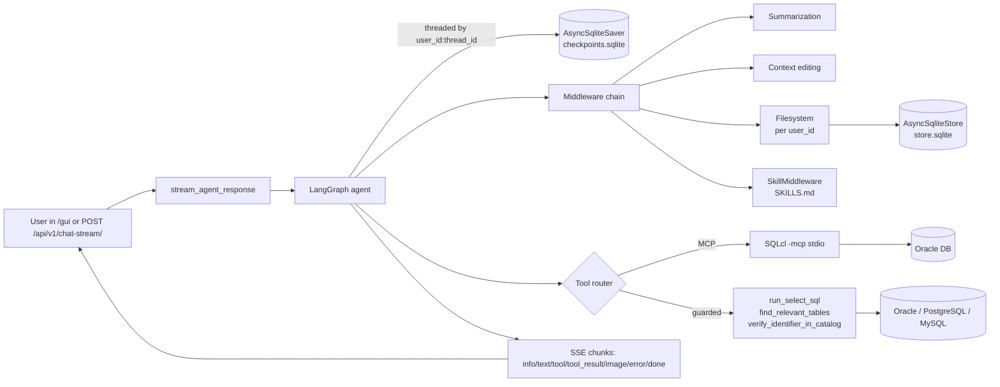

# NL2SQL Agent

A **FastAPI** service that turns **natural-language questions** into **read-only SQL** through a **LangGraph** agent. It now supports **Oracle, PostgreSQL, and MySQL** through one guarded tool contract, and optionally uses Oracle **SQLcl `-mcp` (stdio)** for richer introspection. The service exposes a chat UI at **`/gui/`** and a streaming JSON API at **`/api/v1/chat-stream/`**.

---

## What it does



The agent has two parallel database paths: backend-agnostic guarded tools for execution and identifier checks on all supported databases, plus optional SQLcl-MCP for Oracle-specific introspection (table descriptions, sample rows, query execution). The curated `tools.py` wrappers enforce a **strict read-only `SELECT`** guard with sqlglot-based cure-and-validate against `schema.json`.

In the `/gui/` sidebar, saved connection profiles (Oracle/Postgres) render as a selectable list. Use **Admin connections** in the sidebar footer to create/update/delete profiles in `data/connections.json` (or `CONNECTION_STORE_PATH`). The selected profile is sent with each message; Oracle profiles also trigger SQLcl MCP `connect` switching before streaming. Query tool results in the chat bubble can be exported directly as **CSV**, **XLSX**, or **PDF**.

---

## Repository layout

| Path | Role |
|------|------|
| `src/nl2sql_agent/main.py` | FastAPI app, `/health`, `/api/v1/chat-stream/`, lifespan, NiceGUI mount |
| `src/nl2sql_agent/web.py` | NiceGUI chat page mounted at `/gui` |
| `src/nl2sql_agent/generator.py` | SSE streamer wrapping `agent.astream(stream_mode="messages", ...)` |
| `src/nl2sql_agent/charts.py` | Deterministic chart parser/renderer for tabular tool results |
| `src/nl2sql_agent/llm_factory.py` | Multi-provider chat-model factory (OpenAI / Anthropic) |
| `src/nl2sql_agent/mcp_bridge.py` | SQLcl `-mcp` discovery + saved-connection helpers |
| `src/nl2sql_agent/tools.py` | LangChain `@tool` wrappers around the safety net |
| `src/nl2sql_agent/skills.py` | `SkillMiddleware` + `load_skill` tool |
| `src/nl2sql_agent/executor.py` | sqlglot SELECT-only guard, cure-and-validate, backend-routed execution |
| `src/nl2sql_agent/catalog.py` | Backend router for catalog checks |
| `src/nl2sql_agent/oracle_catalog.py` | Oracle `ALL_OBJECTS` lookup |
| `src/nl2sql_agent/postgres_catalog.py` | PostgreSQL `information_schema` lookup |
| `src/nl2sql_agent/mysql_catalog.py` | MySQL `information_schema` lookup |
| `src/nl2sql_agent/schema_loader.py` | Load `schema.json`, budgets, known object names |
| `src/nl2sql_agent/schema_retrieval.py` | Fuzzy table selection used by `find_relevant_tables` |
| `src/nl2sql_agent/settings.py` | `pydantic-settings` → environment variables |
| `src/nl2sql_agent/models.py` | `UserMessage` request model for chat endpoints |
| `skills/SKILLS.md` | Skill index injected into the agent's system prompt |
| `memory/` | `AsyncSqliteSaver` + `AsyncSqliteStore` SQLite files (gitignored) |
| `scripts/export_schema.sql` | SQLcl script to emit JSON for `schema.json` |
| `Dockerfile` | Python 3.13-slim + `default-jre-headless` (Java for SQLcl) |
| `tests/` | `pytest` suite |

---

## Prerequisites

- **Python 3.11+** and **[uv](https://github.com/astral-sh/uv)**
- **OpenAI API key** (`OPENAI_API_KEY`) — or `ANTHROPIC_API_KEY` for Claude
- **Database credentials** for your selected backend (`oracle`, `postgres`, or `mysql`)
- **Java 17+** on `PATH` — required only when using Oracle SQLcl-MCP

> Oracle SQLcl is **not** a prerequisite — `scripts/install-sqlcl.{ps1,sh}` downloads it into `vendor/sqlcl/` on demand.

---

## Setup on a new laptop

PowerShell and bash blocks are interchangeable.

### 1. Clone and install Python deps

**Windows (PowerShell):**
```powershell
git clone <repo-url> nl2sql-agent
cd nl2sql-agent
uv venv
.venv\Scripts\Activate.ps1
uv sync --extra dev
```

**macOS / Linux (bash):**
```bash
git clone <repo-url> nl2sql-agent
cd nl2sql-agent
uv venv
source .venv/bin/activate
uv sync --extra dev
```

### 2. Install Oracle SQLcl

The repo doesn't ship SQLcl binaries (~150 MB) — a one-shot script fetches them into `vendor/sqlcl/` (gitignored).

**Windows (PowerShell):**
```powershell
pwsh ./scripts/install-sqlcl.ps1
# Or, if PowerShell 7 isn't installed:
powershell -ExecutionPolicy Bypass -File ./scripts/install-sqlcl.ps1
# Reinstall / upgrade:
pwsh ./scripts/install-sqlcl.ps1 -Force
```

**macOS / Linux (bash):**
```bash
chmod +x scripts/install-sqlcl.sh   # one-time after clone
./scripts/install-sqlcl.sh
# Reinstall / upgrade:
./scripts/install-sqlcl.sh --force
```

What it does: downloads `sqlcl-latest.zip` from `download.oracle.com`, extracts the inner `sqlcl/` folder into `./vendor/sqlcl/`, marks the launcher executable on Unix, cleans the temp files. Idempotent. Needs `java -version` to succeed (the script warns and continues if Java is missing).

### 3. Install Oracle Instant Client (thick-mode runtime)

`python-oracledb` in **thick** mode requires Oracle Instant Client libraries on disk. The repo doesn't ship them (the Windows OCI DLL alone exceeds GitHub's 100 MB file limit) — a one-shot script fetches them into `third_party/instantclient_*` (gitignored). **Skip this step if you've configured `ORACLE_CLIENT_MODE=thin`** in your `.env`.

**Windows (PowerShell):**
```powershell
pwsh ./scripts/install-instantclient.ps1
# Or, if PowerShell 7 isn't installed:
powershell -ExecutionPolicy Bypass -File ./scripts/install-instantclient.ps1
# Reinstall / upgrade:
pwsh ./scripts/install-instantclient.ps1 -Force
# Pin a specific version:
pwsh ./scripts/install-instantclient.ps1 -Version '23.6.0.24.10' -FolderSlug '2360000'
```

**macOS / Linux (bash):**
```bash
chmod +x scripts/install-instantclient.sh   # one-time after clone
./scripts/install-instantclient.sh
# Reinstall / upgrade:
./scripts/install-instantclient.sh --force
# Pin a specific version:
./scripts/install-instantclient.sh --version 23.6.0.24.10 --slug 2360000
```

What it does: detects platform (Windows x64 / Linux x64 / macOS arm64 or x64), downloads `instantclient-basiclite-<platform>-<version>.zip` from `download.oracle.com`, extracts to `./third_party/instantclient_<minor>/`. The script prints the exact path to put in `ORACLE_CLIENT_LIB_DIR` when it finishes. Idempotent.

> **Note**: each Instant Client minor version unzips into its own folder name (e.g. `instantclient_23_6`). If you upgrade to a different version, update `ORACLE_CLIENT_LIB_DIR` in your `.env` to match.

### 4. Create your `.env`

The repo only contains `.env.example` — the real `.env` is gitignored. **On a new laptop, never re-type credentials by hand: copy your `.env` from a password manager.**

```powershell
Copy-Item .env.example .env       # PowerShell
```
```bash
cp .env.example .env              # bash
```

Then fill in:

| Var | What it is |
|-----|------------|
| `OPENAI_API_KEY`, `OPENAI_MODEL` | LLM credentials (`OPENAI_MODEL` defaults to `gpt-4o`) |
| `DB_BACKEND` | `oracle` (default), `postgres`, or `mysql` |
| `ORACLE_DSN` *(or* `ORACLE_HOST` + `ORACLE_SERVICE_NAME`*)* | Database target |
| `ORACLE_RO_USER`, `ORACLE_RO_PASSWORD` | Read-only DB user used by `python-oracledb` |
| `POSTGRES_DSN` *(or* `POSTGRES_HOST` + `POSTGRES_DATABASE` + `POSTGRES_USER` + `POSTGRES_PASSWORD`*)* | PostgreSQL target |
| `MYSQL_HOST` + `MYSQL_DATABASE` + `MYSQL_USER` + `MYSQL_PASSWORD` | MySQL target |
| `ORACLE_CLIENT_MODE=thick` + `ORACLE_CLIENT_LIB_DIR` | Only if you use Instant Client / full client (typical on Windows) |
| `SQLCL_PATH=vendor/sqlcl/bin/sql.exe` | Oracle-only optional MCP path (`vendor/sqlcl/bin/sql` on macOS/Linux) |
| `SQLCL_USER_DIR=.sqlcl` | Keeps SQLcl's wallet inside the repo (gitignored) |
| `CONNECTION_STORE_PATH=data/connections.json` | File-backed profile store used by the in-app Admin menu |
| `SQLCL_CONNECTIONS=[main,RO_USER/RO_PASSWORD@host:1521/service]` | Optional seed source on first boot when the store file is empty |
| `NICEGUI_STORAGE_SECRET=<random>` | Signs per-user session storage |

Optional alternate LLM provider:
```env
ANTHROPIC_API_KEY=...
ANTHROPIC_MODEL=claude-sonnet-4-6
```

If you use a **TNS alias** in `ORACLE_DSN`, the alias must resolve via `ORACLE_CLIENT_CONFIG_DIR` / `TNS_ADMIN`, otherwise you'll see **ORA-12154**. Prefer **Easy Connect** (`host:1521/service`) when you have no local `tnsnames.ora`.

### 5. Export `schema.json`

`tools.find_relevant_tables` uses this snapshot to pick the relevant table slice for every question. Re-run after any DDL change.

**Windows (PowerShell):**
```powershell
vendor\sqlcl\bin\sql.exe -S -name YOUR_CONN @scripts/export_schema.sql > data\schema.json
```

**macOS / Linux (bash):**
```bash
vendor/sqlcl/bin/sql -S -name YOUR_CONN @scripts/export_schema.sql > data/schema.json
```

`YOUR_CONN` is one of the names from `SQLCL_CONNECTIONS`. PowerShell sometimes writes redirected output as **UTF-16**; the loader auto-detects both UTF-8 and UTF-16.

### 6. Run

```bash
uv run python -m uvicorn nl2sql_agent.main:app --host 127.0.0.1 --port 8000
```

> On Windows, prefer `python -m uvicorn` via `uv run` (as shown above) to avoid `Failed to canonicalize script path` errors from direct script entrypoints.

Then open in your browser:

| URL | What it is |
|-----|------------|
| http://127.0.0.1:8000/gui/ | NiceGUI chat page (the primary UX) |
| http://127.0.0.1:8000/docs | Swagger UI — try `/api/v1/chat-stream/` interactively |
| http://127.0.0.1:8000/health | Liveness probe |

`HOST` / `PORT` in `.env` are documentation defaults — the `uvicorn` flags above override them.

---

## HTTP API

### `GET /health`

Returns `{"status": "ok"}` when the process is up.

### `POST /api/v1/chat-stream/`

Server-Sent Events stream. Body:

```json
{
  "message": "list employees hired in 2025",
  "user_id": "u1",
  "thread_id": "t1",
  "connection_id": "main"
}
```

Each chunk is `data: {json}\n\n`, with one of these `type` fields:

| `type` | Payload | Client handling |
|--------|---------|-----------------|
| `info` | Connection acknowledgement | Show "connecting…" |
| `text` | Incremental assistant token | Append to bubble |
| `tool` | `{tools: [...], content: ...}` | Show "Calling: X" chip |
| `tool_result` | Raw tool output | Optional inline render |
| `image` | `{mime, data(base64), spec}` | Render generated chart preview |
| `error` | `{content, kind?, detail?}` | Hide spinner, show toast |
| `done` | Stream terminator | Re-enable input |

Returns **HTTP 503** if `SQLCL_PATH` is empty or the agent failed to boot. Returns **HTTP 429** if the per-user chat rate limit is exceeded (`Retry-After` header included).

---

## Architecture

### Orchestration & state — LangGraph

The agent's logical core runs on **LangGraph**. The graph is built by `langchain.agents.create_agent` inside the FastAPI lifespan ([src/nl2sql_agent/main.py](src/nl2sql_agent/main.py)) and pinned to two SQLite-backed persistence layers:

- **`AsyncSqliteSaver`** (`memory/checkpoints.sqlite`) checkpoints every step of every conversation thread. Re-opening a thread in NiceGUI rehydrates the full message history and tool-call state — survives process restarts.
- **`AsyncSqliteStore`** (`memory/store.sqlite`) is the long-term key-value store the agent uses for per-user memory. Namespaces are keyed by `user_id` so two users never see each other's notes.

A thread is identified by `{user_id}:{thread_id}` so the same user can keep several conversations parallel without state bleeding across them.

### Database layer — MCP + SQLcl

Instead of opening a JDBC/OCI connection, the agent talks to Oracle through the **Model Context Protocol (MCP)**. On lifespan start the service:

1. Calls `check_for_sqlcl(SQLCL_PATH)` and registers each entry in `SQLCL_CONNECTIONS` via `sqlcl_init_config` (saves a named connection so the agent can `conn -name`).
2. Spawns `sql -mcp` as a stdio subprocess managed by `langchain_mcp_adapters.client.MultiServerMCPClient`.
3. Calls `load_mcp_tools(mcp_session)` to introspect everything the SQLcl MCP server exposes and surfaces those as LangChain tools.

The MCP toolset is concatenated with the **guarded executor wrappers** in [src/nl2sql_agent/tools.py](src/nl2sql_agent/tools.py):

| Tool | Wraps | Effect |
|------|-------|--------|
| `run_select_sql(sql)` | `executor.run_select` + `cure_sql_against_schema` | Single-statement read-only SELECTs only; auto-corrects identifier typos against `schema.json` |
| `find_relevant_tables(question, k)` | `schema_retrieval.build_llm_schema_prompt` | Fuzzy-picks the most relevant tables + FK neighbours and returns a ready-made `TABLE … (cols)` block |
| `verify_identifier_in_catalog(name)` | `oracle_catalog.lookup_accessible_object_names` | Confirms the object exists in `ALL_OBJECTS` for the read-only user |
| `get_package_source(name, owner?, max_lines?)` | `ALL_SOURCE` | Reads `PACKAGE` and `PACKAGE BODY` source text for reasoning/debugging |
| `get_function_source(name, owner?, max_lines?)` | `ALL_SOURCE` | Reads standalone function source text |
| `get_procedure_source(name, owner?, max_lines?)` | `ALL_SOURCE` | Reads standalone procedure source text |
| `get_view_definition(name, owner?)` | `ALL_VIEWS` | Returns view query definitions |
| `get_materialized_view_definition(name, owner?)` | `ALL_MVIEWS` | Returns materialized-view query definitions |

Charts and download buttons are intent-gated in `/gui`: chart images are emitted/rendered only when the user explicitly asks for a chart/graph/image, and export buttons (`CSV`, `XLSX`, `PDF`) are shown only when the user explicitly asks to download/export a file.

So the agent uses SQLcl MCP **and** the curated safety net side by side — the SELECT-only guard, sqlglot cure-and-validate, and catalog check stay on the hot path even when the model calls SQLcl directly.

### Context management — middleware chain

| Middleware | Purpose | Threshold |
|------------|---------|-----------|
| `handle_tool_errors` (`@wrap_tool_call`) | Catches tool exceptions and returns a graceful `ToolMessage` so the agent can self-correct | n/a |
| `SummarizationMiddleware` | Summarises older history when the conversation crosses a token budget | trigger 20 000 tokens, keep last 10 messages |
| `ContextEditingMiddleware` (`ClearToolUsesEdit`) | Clears stale tool-call payloads while preserving recent ones | trigger 20 000 tokens, keep last 5 tool uses |
| `FilesystemMiddleware` (deepagents) | Per-user virtual filesystem backed by `AsyncSqliteStore`; the agent saves/reads notes scoped by `user_id` | tool eviction 10 000 tokens; human-message eviction 5 000 |
| `SkillMiddleware` | Appends `skills/SKILLS.md` to the system prompt and exposes `load_skill(path)` so the agent can pull a single skill on demand | n/a |

### Multi-model layer

The factory in [src/nl2sql_agent/llm_factory.py](src/nl2sql_agent/llm_factory.py) lets you swap providers by editing env vars only:

1. **Anthropic** wins when `ANTHROPIC_API_KEY` + `ANTHROPIC_MODEL` are set.
2. Otherwise **OpenAI** is used (`OPENAI_API_KEY` + `OPENAI_MODEL`).

Both branches resolve through `langchain.chat_models.init_chat_model`, so any model string the LangChain unified API accepts (e.g. `claude-sonnet-4-6`, `gpt-4o`) works without further wiring.

### Boot semantics

`DB_BACKEND` selects the guarded execution backend, while `SQLCL_PATH` only controls optional Oracle MCP tooling:

| Condition | Outcome |
|-----------|---------|
| `DB_BACKEND=postgres` or `DB_BACKEND=mysql` with valid credentials | Lifespan builds the agent and serves `/api/v1/chat-stream/` + `/gui/` without SQLcl. |
| `DB_BACKEND=oracle` + valid Oracle creds, `SQLCL_PATH` empty | Lifespan builds the agent with guarded Oracle tools only (no SQLcl MCP tools). |
| `DB_BACKEND=oracle` + `SQLCL_PATH` valid | Lifespan builds the agent with guarded tools + SQLcl `-mcp` tools. |
| Any backend with invalid/missing required DB credentials | Lifespan logs a warning and chat endpoints return **HTTP 503** until fixed. |

---

## Environment reference

| Variable | Purpose |
|----------|---------|
| `OPENAI_API_KEY` | Required (or set Anthropic) |
| `OPENAI_MODEL` | Default `gpt-4o` |
| `ANTHROPIC_API_KEY` / `ANTHROPIC_MODEL` | Optional alternate provider; takes priority over OpenAI when set |
| `DB_BACKEND` | Active backend: `oracle`, `postgres`, `mysql` |
| `ORACLE_DSN` | Oracle DSN; overrides host/port/service when set |
| `ORACLE_HOST` / `ORACLE_PORT` / `ORACLE_SERVICE_NAME` | Build DSN when `ORACLE_DSN` empty |
| `ORACLE_RO_USER` / `ORACLE_RO_PASSWORD` | Runtime DB user |
| `ORACLE_CLIENT_MODE` | `thick` or thin |
| `ORACLE_CLIENT_LIB_DIR` | Thick: client libraries |
| `ORACLE_CLIENT_CONFIG_DIR` | Thick: `tnsnames`, wallet, etc. |
| `POSTGRES_DSN` | PostgreSQL conninfo string |
| `POSTGRES_HOST` / `POSTGRES_PORT` / `POSTGRES_DATABASE` / `POSTGRES_USER` / `POSTGRES_PASSWORD` | PostgreSQL split config when DSN is empty |
| `MYSQL_DSN` | Reserved for future DSN support (split vars recommended today) |
| `MYSQL_HOST` / `MYSQL_PORT` / `MYSQL_DATABASE` / `MYSQL_USER` / `MYSQL_PASSWORD` | MySQL split connection config |
| `SCHEMA_PATH` | Default `data/schema.json` |
| `SCHEMA_PROMPT_CHAR_BUDGET` | Max chars of schema text in the prompt |
| `SCHEMA_RETRIEVAL_MAX_TABLES` | Cap tables in retrieval slice |
| `SCHEMA_RETRIEVAL_FUZZY_CUTOFF` | Fuzzy name threshold |
| `SQL_CURE_VALIDATE_ENABLED` | Validate/cure SQL against `schema.json` before execution |
| `CHAT_RATE_LIMIT_ENABLED` | Enable in-process rate limiting for chat endpoints |
| `CHAT_RATE_LIMIT_REQUESTS` | Allowed chat requests per window |
| `CHAT_RATE_LIMIT_WINDOW_S` | Rate-limit window size in seconds |
| `MAX_ROWS` | Cap rows returned by `run_select_sql` |
| `QUERY_TIMEOUT_S` | Cursor timeout (seconds) |
| `HOST` / `PORT` | Defaults for your deployment notes |
| `SQLCL_PATH` | Oracle-only optional path to SQLcl `sql`/`sql.exe` for MCP tools |
| `SQLCL_CONNECTIONS` | `[name1,user/password@host:port/service][name2,…]` — saved on lifespan boot |
| `SQLCL_USER_DIR` | Project-local SQLcl wallet dir (recommended `.sqlcl`) |
| `SYSTEM_PROMPT` | Top-level system prompt for the agent |
| `FILESYSTEM_PROMPT` | Memory-instruction prompt injected by `FilesystemMiddleware` |
| `NICEGUI_STORAGE_SECRET` | Signing key for NiceGUI per-user session storage |
| `LANGSMITH_TRACING` / `LANGSMITH_API_KEY` | Optional LangSmith tracing |

See `.env.example` for the canonical list.

---

## Tests

```bash
uv run pytest
```

---

## Verifying end-to-end

After boot, work through these in order:

1. `GET /health` → 200.
2. `POST /api/v1/chat-stream/` with `{"message":"…","user_id":"u1","thread_id":"t1"}` → SSE chunks ending in `data: {"type":"done", ...}`.
3. Open `/gui/`, send a question, refresh the page — the conversation must reload (proves `AsyncSqliteSaver`).
4. In thread A say *"remember my favorite table is X"*, switch to thread B, ask *"what's my favorite table?"* — the answer should reference X (proves `FilesystemMiddleware` + `AsyncSqliteStore`, namespaced by `user_id`).
5. Ask a question whose generated SQL would include `DELETE` or `DROP` — `run_select_sql` must refuse with a non-`SELECT` error.

---

## Docker

```bash
docker build -t nl2sql-agent .
docker run -p 8000:8000 --env-file .env \
  -v $PWD/memory:/workspace/memory \
  -v $PWD/vendor/sqlcl:/workspace/sqlcl_files \
  nl2sql-agent
```

---

## License and changelog

See **`LICENSE`** (if present) and **`CHANGELOG.md`** for release notes.
